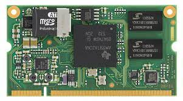
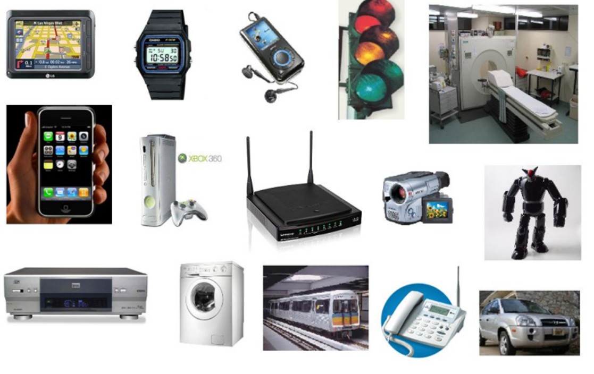
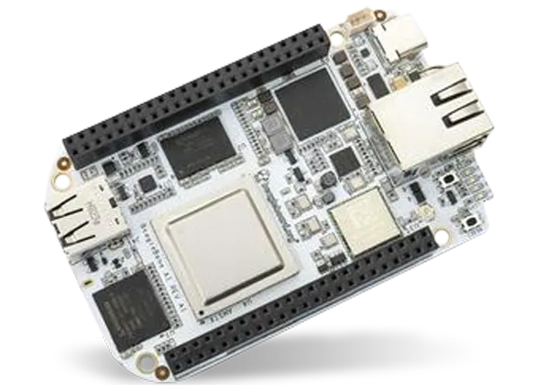
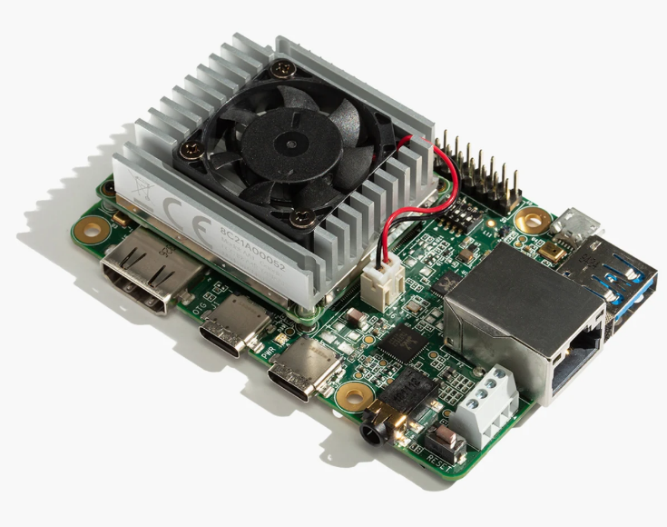
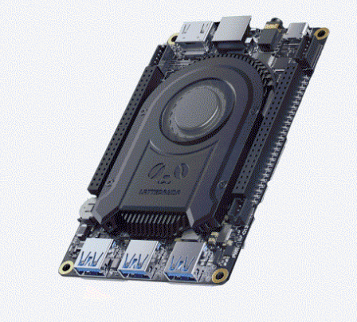
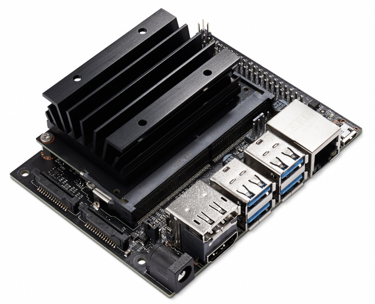
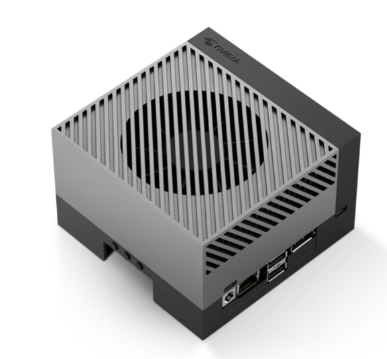

# Visión Computacional
### Embedded and Edge devices

Jose Laruta

Diplomado en Sistemas Robóticos avanzados - Unifranz - Octubre 2021

---
# Agenda

1. Introducción
2. Dispositivos embebidos
3. Placas de desarrollo 
5. Consideraciones especiales
6. Demo

---

# Introducción

Durante el módulo hemos explorado distintos algoritmos, técnicas y aplicaciones de las redes neuronales en tareas de visión artificial.

Todas estas aplicaciones las hemos realizado en un entorno de escritorio o en la nube (google colab).

Sin embargo, en el mundo real, a menudo es necesario poder realizar la inferencia en dispositivos embebidos.

---

## Sistemas Embebidos

Son sistemas computacionales de **propósito específico** con diversas restricciones en latencia, consumo de energia, tamaño y rendimiento.

---

## 

---

## Embedded Linux

Usualmente, para que un sistema embebido pueda usarse en aplicaciones de visión, se necesita lo siguiente:

  - Implementación de interfaces (USB, Ethernet, CSI) para cámaras.
  - Disponibilidad de librerías y herramientas de cómputo (numpy, eigen, tensorflow).
  - Cantidades sustanciales de memoria RAM.
  - Aceleradores gráficos y módulos de aceleración especial (GPU, VPU, DSP)

---

## Embedded Linux

Los microcontroladores dominan el mercado de sistemas embebidos, sin embargo, para aplicaciones de visión artificial, es necesario contar con más capacidad de procesamiento.

Es cómun encontrar dispositivos embebidos que usan un SO basado en GNU/Linux capaz de ejecutar algoritmos de visión de manera eficiente.

---

## Raspberry Pi

Es una de las placas de desarrollo más populares.

 - Quad-core ARM @1.5GHz
 - 1, 2, 4, 8 GB RAM
 - Gb Ethernet, USB, CSI, DSI, HDMI, WiFi, Bluetooth.
 - GPU Multimedia.
 - Debian GNU/Linux.

---

## Beaglebone AI

Orientado a aplicaciones industriales de bajo consumo.

 - Dual-core ARM A15
 - 1 GB RAM
 - Gigabit Ethernet, USB, HDMI, WiFi, Bluetooth.
 - **2x DSP, 4x EVE, 2x PRU, 2x CortexM4, GPU.**
 - Debian GNU/Linux

---

## Google Coral

Con acelerador de ML.

 - Quad-core ARM A53
 - 1 GB RAM
 - Gigabit Ethernet, USB, HDMI, WiFi, Bluetooth.
 - **Google Edge TPU**.
 - Debian GNU/Linux

---

## Lattepanda

SBC con arquitectura x86.

 - Quad-core Intel N5105 64bits
 - 8 GB RAM
 - USB 3.2, HDMI, WiFi, Bluetooth.
 - **Intel UHD, Arduino Leonardo**.
 - Windows, GNU/Linux

---

## Nvidia Jetson Nano

GPU Nvidia incorporada.

 - Quad-core ARM A57
 - 2, 4 GB RAM
 - GB Ethernet,USB 3.0, HDMI, CSI, PCI-E.
 - **128 core Nvidia Maxwell**.
 - Ubuntu GNU/Linux

---

## Nvidia Jetson AGX Orin

GPU Nvidia incorporada.

 - 12-core ARM A78
 - 32 GB RAM
 - 10GB Ethernet,USB 3.2, DP, CSI, PCI-E.
 - **2048 core Nvidia Ampere, 2xNVDLA, PVA**.
 - Ubuntu GNU/Linux

---

## Demo

---

