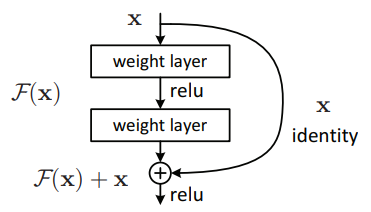
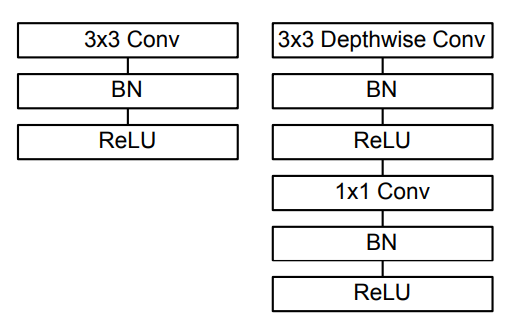
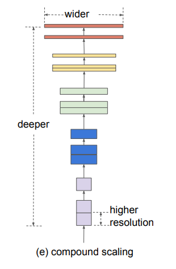

# Visión Computacional
### Image Segmentation

Jose Laruta

Diplomado en Sistemas Robóticos avanzados - Unifranz - Octubre 2021

---
# Agenda

1. Introducción
2. Autoencoders
3. Segmentacion de imágenes
4. Fully convolutional
5. Unet
---

# Introducción

En anteriores sesiones, hemos visto cómo definir y entrenar una red neuronal convolucional desde el inicio. Este enfoque, si bien es eficiente y sirve para tareas y conjuntos de datos personalizados, no siempre es la forma más eficiente de desarrollar una aplicación.

---

## ConvNets como backbone

En anteriores sesiones vimos cómo las capas convolucionales funcionan más bien como **extractores de características** que, a través del entrenamiento por la retropropagación, encuentran los filtros y resaltan las características más importantes para la tarea de predicción. 

Esta etapa inicial se suele denominar el backbone de una red convolucional.

---

## Arquitecturas para clasificación de imágenes

Durante los últimos años se han desarrollado varios tipos de arquitecturas que utilizan distintos mecanismos para poder generar modelos con mayor precisión, mejor entrenamiento y mayor eficiencia. Exploraremos algunas de las arquitecturas más populares en la tarea de clasificación.

---

## VGG

VGG fue una de las primeras arquitecturas en incluir una cantidad elevada de capas ocultas. Se compone de un *stack* de bloques convolucionales con filtros 3x3 y 1x1, activación *relu* y *maxpooling* de 2x2, seguido de tres capas densamente conectadas.

VGG propone distintas configuraciones de las cuales las más populares son **VGG16** y **VGG19**.

Fuente: *[Very Deep Convolutional Networks for Large-Scale Image Recognition](https://arxiv.org/abs/1409.1556)* 

---

## Resnet

Resnet propone un enfoque de bloques *residuales* mediante los cuales se resuelve el problema de *vanishing gradients* en redes neuronales muy profundas. 

Fuente: *[Deep Residual Learning for Image Recognition](https://arxiv.org/abs/1512.03385)* 

---

## MobileNet

Se introduce el uso de *depth-wise convolution* para disminuir la cantidad de procesamiento en los bloques convolucionales sin pérdida sustancial de precisión.

Fuente: *[MobileNets: Efficient Convolutional Neural Networks for Mobile Vision Applications](https://arxiv.org/abs/1704.04861)* 

---

## EfficientNet

Se basa en una definición de escalado en parámetros y profundidad tomando en cuenta la cantidad de cómputo necesaria para distintos niveles de precisión.

Fuente: *[EfficientNet: Rethinking Model Scaling for Convolutional Neural Networks](https://arxiv.org/abs/1905.11946)* 

---

