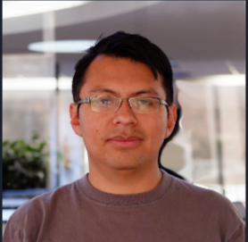

# Visión Computacional
### Vistazo general del módulo

Jose Laruta

Diplomado en Sistemas Robóticos avanzados - Unifranz - Octubre 2021

---
# Agenda

1. Introducción al módulo
2. Contenidos
3. Logística
4. Herramientas y entorno

---

# Introducción al módulo

### Objetivo:
Introducir conceptos, técnicas, aplicaciones y herramientas para sistemas de visión computacional moderna orientado a sistemas robóticos.

---

### Acerca de mi

Data Pipeline Engineer

  - ETL, Procesamiento y consolidación de datos
  - Proveedores en la nube
  - Sistemas distribuidos, serverless
  - Scala, Python, SQL

Profesor, Universidad La Salle:

  - Inteligencia Artificial
  - Aprendizaje Automático

---

### Requisitos

  - Programación básica
  - Álgebra lineal 
  - Cálculo

---

## Contenidos:

1. **Fundamentos de imágenes digitales**
    a. Introducción y generalidades
    b. Cámaras digitales y sensores de visión
    c. Espacios de color y representaciones

2. **Procesamiento digital de imágenes**
    a. Normalización y transformaciones
    b. Filtros convolucionales
    c. Operaciones morfológicas
    d. Transformación de perspectiva.

---

## Contenidos: (cont.)

3. **Extracción de características** (Enfoque clásico)
  a. Detección de color y máscaras
  b. Detección de bordes y detección de esquinas
  d. Algoritmos clásicos de detección de objetos

4. **Redes neuronales convolucionales**
  a. Redes neuronales y deep learning
  b. Redes convolucionales
  c. Clasificación de imágenes
  d. Arquitecturas de redes convolucionales
  e. Transfer learning y técnicas avanzadas

---

## Contenidos: (cont.)

5. **Aplicaciones avanzadas en visión**
  a. Detección de objetos
  b. Segmentación semántica
  c. Detección de rostros y marcadores faciales
  d. Estimación de pose
  e. Optimización y despliegue en producción*
  f. Retos y futuras aplicaciones

---

## Logística

Sesiones en vivo y asíncronas en el siguiente horario:

  - `Jueves`: **19:00 - 22:00**
  - `Viernes`: **19:00 - 22:00**
  - `Sábado`: **8:00 - 12:00**

Las sesiones consistirán de aspectos teóricos conceptuales y laboratorios/tutoriales/demos de programación.

---

## Herramientas y entorno

El entorno de desarrollo se basa enteramente en herramientas gratuitas y open source, es necesario contar con un entorno uniforme para poder seguir los tutoriales y realizar los ejercicios de programación.

  - `Hardware`: 4GB RAM, quad-core, 64bits (*mínimo*)
  - `Sistema operativo`: indistinto (*Recomendado: Ubuntu 20.04*)
  - `Lenguaje de Programación`: Python 3 (v3.7+), GCC*, CMake*
  - `Entorno de desarrollo integrado`: Visual Studio Code, Pycharm
